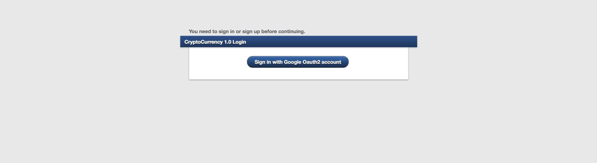
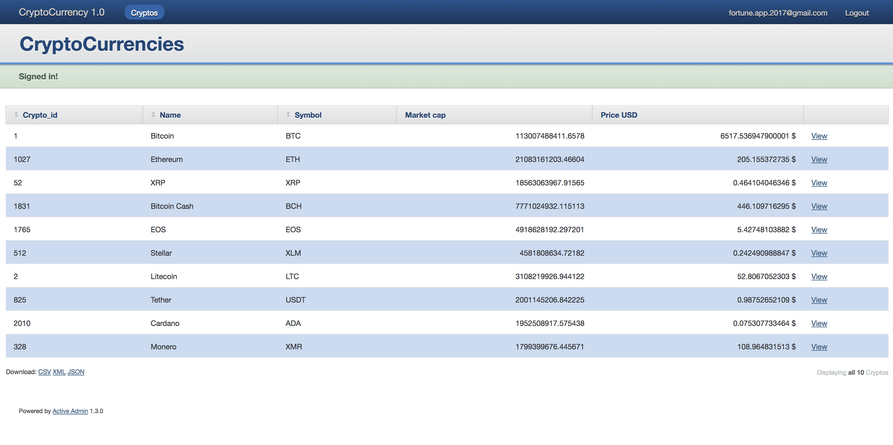

# README

# Crypto_Login

Ruby on Rails application which displays a table of top10 cryptocurrencies (via API). Before displaying the table, it authenticate the user using a Google account ( Devise & omniauth-google-oauth2 ).

Enviroment

* Ruby: 2.5.1

* Rails: 5.2

* Activeadmin: 1.3.0

After download or clon the project, run the following commands in the project folder:

	1 - docker-compose build

	2 - docker-compose up

	OR

	1 - docker-compose up --build

Open the browser and write http://localhost:3001 or http://localhost:3001/admin/login.

Login with your Google account...

...and you can see the top10 cryptocurrencies info. If you want the realtime cryptocurrencies info, click the Cryptos button.

以上